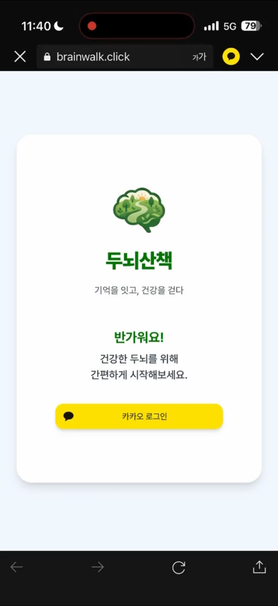

# 두뇌산책


## 👥 팀원 소개

<table style="width:100%; text-align:center;">
  <thead>
    <tr>
      <th>양준석</th>
      <th>박재하</th>
      <th>모희주</th>
      <th>윤준상</th>
      <th>이슬이</th>
      <th>조하은</th>
    </tr>
  </thead>
  <tbody>
    <tr>
      <td>
        <br>
        🔗 <a href="https://github.com/YJunSuk">YSunSuk</a>
      </td>
      <td>
        <br>
        🔗 <a href="https://github.com/horolo1234">horolo1234</a>
      </td>
      <td>
        <br>
        🔗 <a href="https://github.com/heejudy">heejudy</a>
      </td>
      <td>
        <br>
        🔗 <a href="https://github.com/wnstkd704">wnstkd704</a>
      </td>
      <td>
        <br>
        🔗 <a href="https://github.com/0lthree">0lthree</a>
      </td>
      <td>
        <br>
        🔗 <a href="https://github.com/haeuniiii">haeuniiii</a>
      </td>
    </tr>
  </tbody>
</table>

<br>

## 📍 목차

1. [프로젝트 개요](#1-프로젝트-개요)
2. [배경 및 필요성](#2-배경-및-필요성)
3. [기술 스택](#3-기술-스택)  
4. [시스템 아키텍처](#4-시스템-아키텍처)
5. [프로젝트 구조](#5-프로젝트-구조)
6. [와이어 프레임](#6-와이어-프레임) 
7. [서비스 시나리오 테스트](#7-서비스-시나리오-테스트)
8. [기능 테스트 결과](#8-기능-테스트-결과)
9. [기능 테스트 결과서](#9-기능-테스트-결과서)
10. [회고](#9-회고)

<br>

## <a id="1-프로젝트-개요"></a> 1. 프로젝트 개요  

본 프로젝트는 치매 예방을 목적으로 하는 웹사이트를 개발하는 것을 목표로 한다.


최근 인구 고령화가 빠르게 진행되면서 치매 환자 수 또한 지속적으로 증가하고 있으며, 이에 따라 개인과 사회가 부담해야 하는 경제적·사회적 비용 또한 점점 커지고 있다. 이러한 문제를 예방적인 관점에서 접근하기 위해, 사용자가 일상 속에서 간단한 두뇌 활동을 꾸준히 수행할 수 있도록 돕는 웹 기반 서비스를 기획하였다.

본 웹사이트는 사용자에게 매일 미션 3가지를 제공하여 지속적인 두뇌 활동을 유도한다. 제공되는 미션은 미니 게임, 개방형 질문, 하루 기록으로 구성되어 있으며, 각각의 활동을 통해 기억력과 사고력 등을 자극하고 자신의 일상생활을 돌아볼 수 있도록 설계하였다.

먼저 미니 게임은 문제의 지시사항을 읽고 그에 맞는 정답을 선택하는 방식으로 진행되며, 사용자가 간단한 문제 해결 과정을 통해 두뇌를 활용하도록 돕는다. 개방형 질문은 사용자가 단순한 단답형 답변이 아닌 자신의 과거 경험이나 기억을 떠올리며 서술하도록 유도하여 회상 능력과 사고 활동을 촉진한다. 마지막으로 하루 기록은 사용자가 자신의 하루를 돌아보며 오늘의 기분, 식사, 수면 등 생활 패턴을 기록하도록 하여 일상에 대한 인식과 자기 성찰의 시간을 갖는다.

이와 같은 기능을 통해 사용자가 일상 속에서 자연스럽게 두뇌 활동을 지속할 수 있도록 하여 치매 예방에 긍정적인 영향을 줄 수 있는 웹 서비스를 제공하고자 한다.

<br>


## <a id="2-배경-및-필요성"></a> 2. 배경 및 필요성

중앙치매센터[[1]](https://www.nid.or.kr/info/dataroom_view.aspx?bid=317)에 따르면, 전국 65세 이상 추정 치매 환자 수는 2019년 이후 매년 증가하는 추세를 보이며 2023년에는 약 87만 명으로 전년 대비 약 5.1% 증가한 것으로 나타났다.


치매 환자의 증가와 함께 경제적 부담 또한 큰 문제로 대두되고 있다. 치매 환자 1인당 연간 관리 비용은 연간 가구 소득의 약 43.8%에 해당하는 수준으로 나타나 개인과 가족에게 상당한 부담이 되고 있다. 향후 고령 인구의 증가와 함께 치매 환자 수 역시 지속적으로 증가할 것으로 예상되기 때문에, 치매를 치료하는 것뿐만 아니라 사전에 예방하는 것이 매우 중요하다.


치매 예방을 위해서는 낱말 맞추기, 글쓰기, 문화 및 취미 활동과 같이 뇌세포를 지속적으로 자극할 수 있는 두뇌 활동을 꾸준히 수행하는 것이 중요한 것으로 알려져 있다. 특히 이러한 활동을 즐겁고 지속적으로 수행하는 것이 장기적인 예방 효과에 긍정적인 영향을 줄 수 있다.

이에 본 프로젝트에서는 사용자가 일상생활 속에서 부담 없이 참여할 수 있는 웹 기반 치매 예방 서비스를 기획하였다. 사용자가 매일 간단한 미션을 수행하면서 지속적인 두뇌 활동을 유도하고 치매 예방에 도움을 줄 수 있는 환경을 제공하고자 한다.

<br>

## <a id="3-기술-스택"></a> 3. 기술 스택

### FRONTEND


### BACKEND


### DATABASE


### DEPLOYMENT


### FRAMEWORKS, PLATFORMS, LIBRAIRES


### DOCUMENTATION


<br>


## <a id="4-시스템-아키텍처"></a> 4. 시스템 아키텍처

<details>
<summary><b>🧱 시스템 아키텍처 펼쳐보기</b></summary>

</br>

</details>

<br>

## <a id="5-프로젝트-구조"></a> 5. 프로젝트 구조

<details>
<summary><b>📁 폴더 구조 펼쳐보기</b></summary>

```txt
src/
├── api/              # API 통신 모듈 (Axios 인스턴스 및 도메인별 엔드포인트)
├── assets/           # 정적 리소스 (Pretendard 폰트, 로고, 게임/트로피 이미지)
├── components/       # 재사용 UI 컴포넌트
│   ├── common/       # 공용 다이얼로그 (Success / Error / Confirm)
│   ├── daily-record/ # 기록 섹션 컴포넌트
│   ├── mainPage/     # 메인화면 전용 컴포넌트 (로그인 모달 등)
│   ├── minigame/     # 게임 가이드 및 공통 UI
│   └── statistics/   # 통계 차트, 캘린더, 트로피 컴포넌트
├── composables/      # 비즈니스 로직 분리 (타이머, 테마, 데이터 처리 Hook)
├── data/             # 로컬 JSON 데이터 (게임 문제, 기록 옵션)
├── layouts/          # 페이지 레이아웃 관리 (MainLayout)
├── pages/            # 주요 서비스 화면
│   ├── daily-record/ # 일상 패턴 기록 페이지
│   ├── login/        # 카카오 로그인 및 콜백 처리
│   ├── mainpage/     # 대시보드 (진행률, 오늘의 루틴)
│   ├── minigame/     # 미니게임 (산수, 가위바위보, 단어기억)
│   ├── open-question/# 개방형 질문 페이지
│   └── statistics/   # 인지 추이 및 활동 상세 통계
├── router/           # Vue Router 경로 정의
├── store/            # 전역 상태 관리 (Auth, Settings)
├── utils/            # 유틸리티 함수 (JWT 처리 등)
├── App.vue           # 최상위 루트 컴포넌트
└── main.js           # 앱 엔트리 포인트 및 초기 설정
```
</details>
<br/><br/>

## <a id="6-와이어-프레임"></a> 6. 와이어 프레임

<details>
<summary><b>📱 와이어 프레임 링크</b></summary>
  
- [📱 와이어 프레임 (링크)](https://www.figma.com/design/gyX3NlACpQIADuk9ZCbxI5/두뇌산책?node-id=202-78&p=f&t=aJAPNPAJ4FySe4Zt-0)

</details>

<br>

## <a id="7-서비스-시나리오-테스트"></a> 7. 서비스-시나리오-테스트

<details>
<summary><b>🎬 서비스 시나리오 테스트</b></summary>

아래는 실제 서비스 기능을 검증한 시연 영상입니다.
<br>
[](gif\시나리오영상.mp4)
<br>

</details>

<br>

## <a id="8-기능-테스트-결과"></a> 8. 기능 테스트 결과(gif)
  
<details> 
	<summary><b>회원정보 관리</b></summary> 
	<h4>🔸카카오계정 로그인 및 회원 식별</h4>
	 
  <br>
  <h4>🔸추가 프로필 기본 정보 입력</h4>
	
	<br>
  <h4>🔸회원 이메일과 보호자 이메일이 중복 되는 경우</h4>
	
	<br>
	<h4>🔸추가 정보 양식 오류</h4>
	 
  <br>
  <h4>🔸회원 전화번호와 보호자 전화번호가 같은 경우</h4>
	 
  <br>
  <h4>🔸회원 프로필 페이지 접근</h4>
	 
  <br>
  <h4>🔸회원 정보 수정</h4>
	 
  <br>
  <h4>🔸보호자 동의 철회</h4>
	 
  <br>
  <h4>🔸고대비 모드 및 글자크기 수정 후 재로그인 시 기존 정보 유지</h4>
	
  <br>
  <h4>🔸로그아웃</h4>
	 
  <br>
  <h4>🔸회원 탈퇴</h4>
	 
  <br>
  <h4>🔸회원 복구</h4>
	
  <br>
</details> 

<details> 
	<summary><b>루틴 관리</b></summary> 
	<h4>🔸오늘의 루틴 작동</h4>
	 
  <br>
  <h4>🔸오늘의 루틴 100%</h4>
	
</details> 

<details> 
	<summary><b>인지 콘텐츠 관리(미니게임)</b></summary> 
	<h4>🔸단어 연상</h4>
	 
	<br>
	<h4>🔸데카르트 가위바위보</h4>
	 
  <br>
  <h4>🔸사칙 연산</h4>
	 
</details> 

<details> 
	<summary><b>기억 / 정서 관리 (개방형 질문, 하루기록)</b></summary> 
	<h4>🔸개방형질문 시작</h4>
	 
	<br>
	<h4>🔸개방형질문 이탈</h4>
	 
	<br>
  <h4>🔸개방형질문 이탈 후 재시작</h4>
	
  <br>
  <h4>🔸개방형질문 완료</h4>
	
  <br>
  <h4>🔸하루기록 필수값이 미입력된 경우</h4>
	
  <br>
  <h4>🔸하루기록 완료 및 저장</h4>
	
  <br>
</details> 

<details> 
  <summary><b>조회 / 통계</b></summary> 
  <h4>🔸캘린더 조회</h4>
	
  <br>
	<h4>🔸미니게임 통계 조회</h4>
	
  <br>
  <h4>🔸트로피 획득 내역 조회</h4>
	
  <br>
</details>

<details> 
    <summary><b>공지사항</b></summary>
    <h4>🔸공지사항 조회</h4>
     
</details>

<br/><br/>


## <a id="9-테스트-보고서"></a> 9. 테스트 보고서(스프레드 시트)

<details>
 <summary><b>🧾 프론트엔드 테스트</b></summary>

  - [🧾 프론트엔드 테스트 결과서 (링크)](https://docs.google.com/spreadsheets/d/1cGxKolGeDWGtzUYxWShYSNCS0KK_gclYAco5hxDQDqI/edit?gid=687771753#gid=687771753)

</details>
<br>


## <a id="10-회고"></a> 10. 회고

|   이름   |     회고 내용     |
|-----------|-----------------|
|      양준석      |     이번 프로젝트를 진행하면서 좋았던 부분은 팀원들 각자 역할을 분배 받아 맡은 일을 잘 수행하여 프로젝트를 완성한 점이라고 생각한다. 그리고 설계했던 부분들의 방향성을 잃지 않고 설계에 많은 시간을 투자한 만큼 결과물이 잘 나와서 다행이라고 생각한다. 하지만 디테일한 부분에서 문제점이 많았다. 용어 정리와 한두 개 정도의 기능 논의 사항을 자료로 통일하지 못해 개발 진행 시 모두가 동일한 생각으로 진행하지 않은 것 같다. 그 때문에 프로젝트를 마무리할 때 꽤 많은 리팩토링을 해야 한 점이 아쉬웠다. 그리고 하고 싶은 계획은 있었지만 진행하지 못한 것들이 많다. 트러블 슈팅과 백로그 작성 등 프로젝트 기획 부분과 중간 회고 작성 같은 다양한 부분을 프로젝트 진행 시간이 부족해 하지 못한 것이 많이 아쉽다. 최종 프로젝트에서는 주어지는 시간이 많으니 이 중 절반 이상이라도 시도해보고 싶은 욕심이 있다.    |
|      박재하      |     이번 프로젝트에서 로그인 부분과 프로필 조회, 수정, 복구와 탈퇴 파트를 전담하며 실제 서비스를 구현해보는 경험을 했다. 이 과정을 통해 API 명세서의 중요성과 보안과 사용자 경험, Pinia를 통한 데이터의 일관성에 대해 배울 수 있었다. <br>백엔드 파트와의 원활한 통신을 위해서 API 명세서가 설계도 역할을 하며 백엔드 파트에 어떤 데이터를 전달할지 알려주는 가교 역할을 했다. 앞으로의 프로젝트에 있어서 API 명세서 구현에 더욱 신경쓸 것 같다. 예외처리에 대해서도 더욱 자세히 명시하고 어떤 데이터를 주고받을지도 더욱 고심하며 작업해야 할 것 같다. <br>인증 보안 사고에 있어서 토큰 저장소를 설정하는데 있어서 세밀히 접근했다. 백엔드 파트에서 엑세스 토큰을 30분으로 설정했기 때문에 토큰이 만료되었을 때 어떻게 해야할지 계속 고민했었다. 그래서 엑세스 토큰이 만료되면 백그라운드에서 토큰을 자동으로 갱신하고 리프레시 토큰도 같이 교체하는 로직을 구현했다. 이를 통해 사용자의 경험도 중시하면서 보안도 해치지 않는 설계에 대해 생각해볼 수 있었다. <br>사용자의 정보를 관리하는 방법에 대해서는 Pinia를 통해 전역으로 관리하고 중앙 처리하도록 했다. 어떤 화면에서든 동일한 데이터가 전달되어야하며 데이터가 훼손되어서는 안된다. 따라서 Pinia를 통해 사용자의 데이터를 보장하고 API 비동기 통신을 통해 컴포넌트를 분리하는 방법에 대해 배울 수 있었다. <br>백엔드 파트 못지 않게 프론트 부분에서도 보안에 대한 고민을 계속했다. 이 과정에서 RTR과 Slient Rotation이라는 방법에 대해 학습했고 직접 구현하면서 사용자의 경험을 깨지 않는 방법과 보안을 유지하는 방법 이 두가지가 양립할 수 있다는 것을 배울 수 있었다. 특히 다수의 API가 동시에 만료되는 경우 failedQueue를 활용해서 한번의 재발급으로 모든 대기중인 요청도 안전하게 재수행함으로써 서버 자원의 효울적 관리와 동시성을 해결했다. <br>     |
|      모희주      |     희주님 작성     |
|      윤준상      |     이번 프로젝트를 통해 가장 중요하게 고민한 부분은 데이터베이스 설계 중 데이터를 DB에 별도로 저장할지, 아니면 조회 시점에 원본 데이터를 가져와 백엔드에서 계산할지”였습니다. 이렇게 설계한 이유는 통계 수식이나 기준이 변경될 가능성 있는 값들은 원본 데이터만 유지하고 MyBatis를 통해 필요한 기록을 조회한 뒤 Java에서 유연하게 계산할 수 있게 하는것이 적합하다고 생각하였습니다. 반면 트로피 도메인에서는 단순 계산값이라기보다 “사용자가 특정 조건을 달성했는가”라는 상태 정보의 성격이 강하기 떄문에 한 번 확정된 달성 이력은 저장하는 편이 적절하다 판단했습니다. 이 과정을 통해 무조건적인 정규화나 저장이 정답이 아니라, 시스템의 트래픽과 비즈니스 요구사항에 따른 유연한 설계가 중요하다는 것을 생각하게 되었습니다.     |
|      이슬이      |     지난 백엔드 프로젝트에서 기능 구현을 해본 경험을 바탕으로, 이번에는 프론트엔드 개발을 진행했다. 당연한 이야기지만 프론트엔드는 또 완전히 다른 영역이었다. 실제로 화면이 어떻게 보이는지 확인하면서 수정 작업을 할 수 있다는 점은 재미있었지만, 그 전에 화면을 어떻게 구성할지 고민하는 과정이 생각보다 훨씬 어려웠다. 구글 메인 화면을 매일 수십 번씩 보면서도 각 기능의 위치를 아무렇지 않게 받아들였는데, 이번 프로젝트를 통해 그런 것들이 결코 당연한 게 아니라는 걸 깨닫게 되었다. 팀 프로젝트로 하나의 서비스를 개발하면서, 평소에는 그냥 사용하던 웹이나 앱의 기능들이 실제로는 어떻게 동작하는지 자연스럽게 더 고민하게 되었다. 무엇보다도 하나의 서비스를 함께 만들어가기 위해 고민해준 팀원들에게 정말 고마움을 느낀다. 팀원들을 보면서 많이 배우기도 했고, 비전공자로서 한 단계 더 성장할 수 있었던 시간이었다.     |
|      조하은      |     프론트엔드와 백엔드를 연동하는 과정에서 API 명세서를 어떤 기준으로 작성해야 할지 몰라 한참을 헤맸다. DTO 구조, 데이터 타입, null 처리 등을 맞추는 작업도 예상보다 까다로웠다. 단순히 API를 호출하는 것을 넘어 데이터 형식을 정확히 이해하고 일관되게 사용하는 것이 중요하다는 점을 실감했고, 협업 전 명확한 규칙과 문서를 미리 정리해두는 것의 필요성을 느꼈다. <br> 화면을 직접 보며 코드를 작성하고 디자인을 다듬는 과정은 백엔드와는 또 다른 재미가 있었고, 자연스럽게 프론트엔드에 대한 흥미가 생겼다. 이번 프로젝트는 풀스택 개발자로서의 역량을 키우는 계기가 된 것 같다. 다만 테스트 결과를 기능별로 어떤 기준으로 나눌지 체계적으로 정리하지 못한 점은 아쉬움으로 남으며, 다음 프로젝트에서 개선하고 싶은 부분이다.     |

<br>
